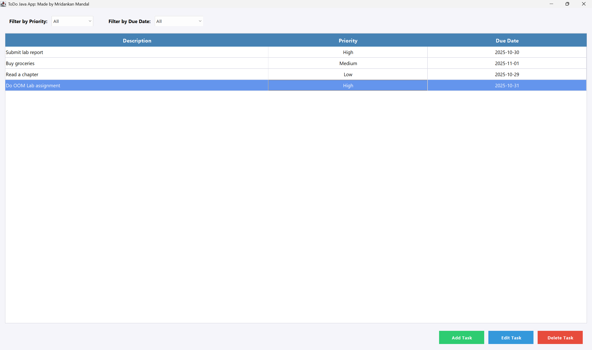

# To-Do Tasks Java Application:

A simple and elegant Java Swing-based To-Do List application with persistent JSON storage.


*The main window showing the task list with filter options and action buttons*

## Features:

- Add, edit, and delete tasks.
- Set task priorities (High, Medium, Low).
- Assign due dates to tasks.
- Filter tasks by priority and due date.
- Automatic JSON-based persistence (tasks saved in `tasks.json`).
- Modern and clean user interface.

## Requirements:

- Java JDK 17 or later.
- Windows, macOS, or Linux.

## Installation:

### Method 1: Using JAR file (Recommended):

1. Ensure Java JDK 17+ is installed on your system.
2. Download or build the `ToDoApp.jar` file.
3. Run the application:
   ```powershell
   java -jar ToDoApp.jar
   ```

   Or on Windows, use the provided script:
   ```powershell
   .\start.ps1
   ```

### Method 2: Compiling from source:

1. Clone or download this repository.
2. Compile the source code:
   ```powershell
   javac -d out src\main\java\todojavaapp\*.java src\main\java\todojavaapp\model\*.java src\main\java\todojavaapp\ui\*.java src\main\java\todojavaapp\storage\*.java
   ```
3. Run the application:
   ```powershell
   java -cp out todojavaapp.App
   ```

### Building the JAR file:

To build the JAR file from source:

```powershell
# Compile the source files
javac -d out src\main\java\todojavaapp\*.java src\main\java\todojavaapp\model\*.java src\main\java\todojavaapp\ui\*.java src\main\java\todojavaapp\storage\*.java

# Create the JAR file
jar cfe ToDoApp.jar todojavaapp.App -C out .
```

## Usage:

See [USAGE.md](USAGE.md) for detailed usage instructions.

### Start:

1. Launch the application.
2. Click **Add Task** to create a new task.
3. Enter task description, select priority, and optionally set a due date.
4. Click **Save** to add the task.
5. Select a task and click **Edit Task** to modify it.
6. Select a task and click **Delete Task** to remove it.
7. Use the filter dropdowns to view specific tasks.

## Data Persistence:

All tasks are automatically saved to a `tasks.json` file in the application directory. This file is created automatically when you add your first task and is updated whenever you:
- Add a new task.
- Edit an existing task.
- Delete a task.

The JSON file format is human-readable and can be backed up or shared.

## Project Structure:

```
ToDoJavaApp/
├── src/
│   └── main/
│       └── java/
│           └── todojavaapp/
│               ├── App.java                 # Main application entry point
│               ├── model/
│               │   ├── Priority.java        # Priority enumeration
│               │   └── Task.java            # Task model class
│               ├── ui/
│               │   ├── TaskDialog.java      # Dialog for adding/editing tasks
│               │   ├── TaskTableModel.java  # Table model for task display
│               │   └── ToDoFrame.java       # Main application window
│               └── storage/
│                   └── TaskStorage.java     # JSON persistence layer
├── visuals/
│   └── ToDoJavaAppMainWindow.png
├── start.ps1                                 # Windows launch script
├── USAGE.md                                  # Detailed usage instructions
└── README.md                                 # This file
```

## Technical Details:

- **Language**: Java 17+.
- **UI Framework**: Swing.
- **Data Format**: JSON.
- **Storage**: File-based (tasks.json).
- **Architecture**: MVC-inspired pattern with model, view, and storage layers.

## Credits:

Application developed by **Mridankan Mandal** (RedZapdos123 and WhiteMetagross).

## License:

This project is available for educational and personal use.
