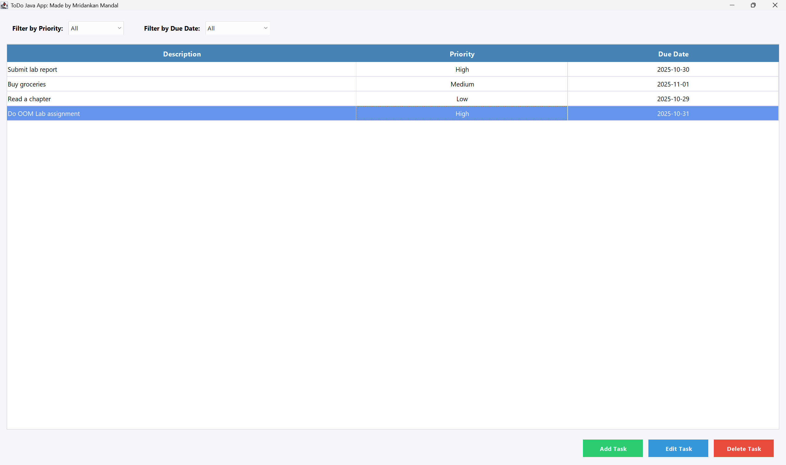

# To-Do List Application Usage Guide

Complete instructions for using the To-Do List Application.


*The main application window displaying task management features including filters and action buttons*

## Getting Started:

### Launching the Application:
Use one of the following methods to start the application.

**Method 1 - Using JAR file (Recommended):**
```powershell
java -jar ToDoApp.jar
```

**Method 2 - Using Windows launcher script:**
```powershell
.\start.ps1
```

**Method 3 - Using compiled classes:**
```powershell
java -cp out todojavaapp.App
```

## Main Window Overview:

### Window Layout:
The main window consists of three primary sections.

**Top Section - Filters:**
- Filter by Priority dropdown with options: All, High, Medium, Low.
- Filter by Due Date dropdown with options: All, Today, This week, Overdue.

**Center Section - Task Table:**
- Description column showing task details.
- Priority column displaying High, Medium, or Low.
- Due Date column showing dates in yyyy-MM-dd format.

**Bottom Section - Action Buttons:**
- Add Task button in green for creating new tasks.
- Edit Task button in blue for modifying selected tasks.
- Delete Task button in red for removing selected tasks.

## Working with Tasks:

### Adding a New Task:
Follow these steps to create a new task.

1. Click the green Add Task button at the bottom right.
2. Enter the task description in the Description field (required).
3. Select a priority level from the Priority dropdown (High, Medium, or Low).
4. Enter the due date in yyyy-MM-dd format (optional).
5. Click the green Save button to create the task.
6. Click the gray Cancel button to discard changes.

**Example Date Formats:**
- 2025-10-29 like October 29, 2025.
- 2025-12-31 like December 31, 2025.
- 2026-01-15 like January 15, 2026.

### Editing an Existing Task:
Follow these steps to modify a task.

1. Click on any task row in the table to select it.
2. Click the blue Edit Task button at the bottom right.
3. Modify the description, priority, or due date as needed.
4. Click the green Save button to apply changes.
5. Click the gray Cancel button to discard changes.

**Note:**
All three attributes (description, priority, due date) can be modified during editing.

### Deleting a Task:
Follow these steps to remove a task.

1. Click on the task row you want to delete.
2. Click the red Delete Task button at the bottom right.
3. Confirm the deletion in the dialog box by clicking Yes.
4. Click No to cancel the deletion.

## Using Filters:

### Filter by Priority:
Display tasks based on their priority level.

1. Click the Filter by Priority dropdown at the top left.
2. Select All to show all tasks regardless of priority.
3. Select High to show only high priority tasks.
4. Select Medium to show only medium priority tasks.
5. Select Low to show only low priority tasks.

### Filter by Due Date:
Display tasks based on their due date category.

1. Click the Filter by Due Date dropdown at the top.
2. Select All to show all tasks regardless of due date.
3. Select Today to show tasks due on the current date.
4. Select This week to show tasks due within the current week (Monday to Sunday).
5. Select Overdue to show tasks with due dates before today.

**Filter Behavior:**
- Filters can be combined (one priority filter and one date filter active simultaneously).
- Changing a filter immediately updates the displayed tasks.
- Adding, editing, or deleting tasks maintains the current filter settings.

## Data Entry Guidelines:

### Task Description:
- Required field that cannot be empty.
- Can contain any text up to reasonable length.
- Supports letters, numbers, and special characters.

### Priority Selection:
- Must select one of three options: High, Medium, or Low.
- Default value is Medium if not explicitly selected.
- Can be changed at any time through the Edit function.

### Due Date:
- Optional field that can be left empty.
- Must follow yyyy-MM-dd format when provided.
- Year must be four digits, month and day must be two digits.
- Invalid formats will trigger an error message.

## Error Messages:

### Common Validation Errors:

**Description Required:**
Displayed when trying to save a task without entering a description.
- Solution: Enter a valid description before saving.

**Invalid Date Format:**
Displayed when the date does not match yyyy-MM-dd pattern.
- Solution: Correct the date format (example: 2025-10-29).
- Alternative: Leave the date field empty if no due date is needed.

## Tips and Best Practices:

### Effective Task Management:
- Use High priority for urgent and important tasks.
- Use Medium priority for regular tasks.
- Use Low priority for tasks that can be deferred.
- Set due dates for time sensitive tasks.
- Use Today filter to focus on immediate tasks.
- Use Overdue filter to identify tasks that need attention.

### Workflow Suggestions:
- Start your session by checking Overdue tasks.
- Review Today tasks to plan your day.
- Use This week filter for weekly planning.
- Regularly delete completed tasks to keep the list clean.

## Keyboard and Mouse Interaction:

### Mouse Operations:
- Single click on a task row to select it.
- Double click has no special function.
- Click filter dropdowns to change filter criteria.
- Click buttons to perform actions.

### Selection Behavior:
- Only one task can be selected at a time.
- Edit and Delete buttons are disabled when no task is selected.
- Add button is always enabled.

## Data Persistence:

### Automatic Saving:
- All task data is automatically saved to a JSON file (`tasks.json`) in the application directory.
- Tasks are saved immediately when you add, edit, or delete them.
- The JSON file is human-readable and can be backed up or transferred.
- Tasks are automatically loaded when the application starts.

### JSON File Location:
- The `tasks.json` file is created in the same directory as the JAR file or where you run the application.
- You can manually edit this file if needed (ensure valid JSON format).
- To reset all tasks, simply delete the `tasks.json` file.

## Troubleshooting:

### Application Does Not Start:
- Verify Java JDK 17 or later is installed.
- Check that the JAR file or compiled classes are present.
- Ensure no other instance of the application is running.

### Buttons Are Not Responding:
- Verify a task is selected before using Edit or Delete buttons.
- Check that the dialog box is not hidden behind other windows.

### Filter Not Working:
- Verify tasks exist that match the filter criteria.
- Try selecting All in both filters to see all tasks.

### Date Validation Fails:
- Ensure date format is exactly yyyy-MM-dd.
- Verify month is between 01 and 12.
- Verify day is valid for the specified month.

## Creator Information:
Application developed by Mridankan Mandal (RedZapdos123 and WhiteMetagross).

## Additional Resources:
- See README.md for installation and compilation instructions.
- See GHCopilot-Agent-Spec.md for technical architecture details.
